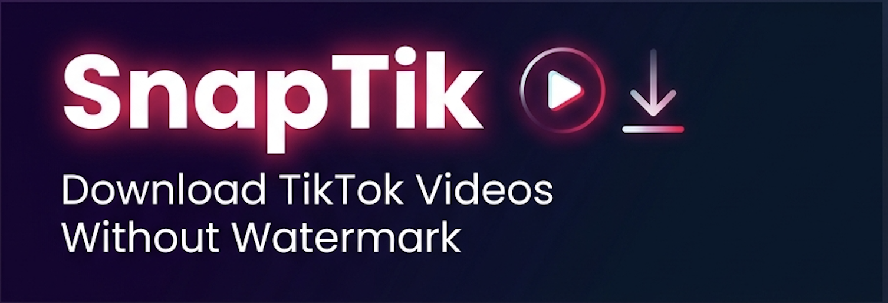
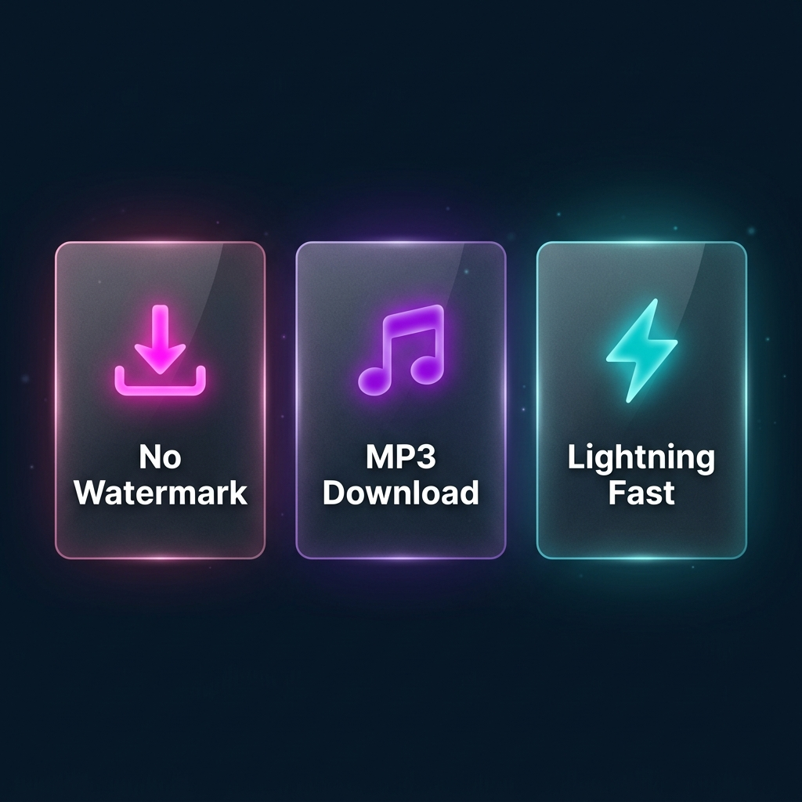

<div align="center">



# SnapTik — TikTok Video Downloader

**Download TikTok videos without watermark — fast, free, and unlimited.**

[](https://nextjs.org/)
[](https://www.typescriptlang.org/)
[](https://chakra-ui.com/)
[](./LICENSE)

[🚀 Live Demo](#) · [🐛 Report Bug](../../issues) · [✨ Request Feature](../../issues)

</div>

---

## ✨ Features



- 🎬 **No Watermark** — Download TikTok videos in HD without the TikTok logo
- 🎵 **MP3 Extraction** — Save audio/music directly from any TikTok video
- ⚡ **Lightning Fast** — Optimized parser with instant results
- 🌍 **Multi-language** — Supports Vietnamese, English, Brazilian Portuguese, Indonesian & more
- 📈 **Trending Discovery** — Browse and download trending TikTok content
- 🔒 **No Login Required** — No account or sign-up needed
- 📱 **Fully Responsive** — Works perfectly on mobile, tablet, and desktop

---

## 🛠️ Tech Stack

| Technology | Purpose |
|---|---|
| **Next.js 13** | React framework with App Router |
| **TypeScript** | Type-safe development |
| **Chakra UI** | Component library & theming |
| **Framer Motion** | Smooth animations |
| **Zustand** | Lightweight state management |
| **Axios** | HTTP client for API calls |

---

## 🚀 Getting Started

### Prerequisites

- **Node.js** >= 16.x
- **npm**, **yarn**, or **pnpm**

### Installation

```bash
# 1. Clone the repository
git clone https://github.com/your-username/snaptik.git
cd snaptik

# 2. Install dependencies
yarn install

# 3. Set up environment variables
cp .env.example .env.local
```

### Environment Variables

Create a `.env.local` file in the root directory:

```env
# API endpoint for TikTok parsing
NEXT_PUBLIC_API_URL=your_api_url_here
```

### Development

```bash
# Start the development server
yarn dev
```

Open [http://localhost:3000](http://localhost:3000) in your browser.

### Build for Production

```bash
# Build the production bundle
yarn build

# Start production server
yarn start
```

---

## 📁 Project Structure

```
snaptik/
├── public/               # Static assets
├── src/
│   ├── components/       # Reusable UI components
│   │   ├── Board.tsx     # Main download board
│   │   ├── Header.tsx    # Page header with SEO meta
│   │   ├── NavBar.tsx    # Navigation bar
│   │   └── Footer.tsx    # Footer component
│   ├── pages/            # Next.js pages & API routes
│   │   ├── api/          # Backend API handlers
│   │   ├── trending/     # Trending TikTok page
│   │   ├── contact/      # Contact page
│   │   └── index.tsx     # Homepage
│   ├── hooks/            # Custom React hooks
│   ├── stores/           # Zustand state stores
│   ├── styles/           # Global CSS styles
│   ├── theme/            # Chakra UI theme config
│   ├── contants.ts       # App constants & regex patterns
│   └── helper.ts         # Utility helper functions
├── types/                # TypeScript type definitions
├── next.config.js        # Next.js configuration
└── package.json
```

---

## 🌐 Supported URL Formats

SnapTik supports all TikTok URL formats:

```
https://www.tiktok.com/@username/video/1234567890123456789
https://vm.tiktok.com/AbCdEfGh/
https://vt.tiktok.com/AbCdEfGh/
```

---

## 💡 How It Works

1. **Paste** a TikTok video URL into the input field
2. **Click** the Download button
3. **Choose** your preferred format — HD Video (no watermark) or MP3 audio
4. **Save** the file to your device instantly

---

## 🤝 Contributing

Contributions are welcome! Feel free to open an issue or submit a pull request.

```bash
# Fork the project, then:
git checkout -b feature/amazing-feature
git commit -m 'feat: add amazing feature'
git push origin feature/amazing-feature
# Open a Pull Request
```

---

## 📄 License

This project is licensed under the **MIT License** — see the [LICENSE](./LICENSE) file for details.

---

<div align="center">

Made with ❤️ by the SnapTik Team

⭐ Star this repo if you find it helpful!

</div>
